<div align="center">

<h1>🤖 Git Standup Agent</h1>

<p><strong>Your git repo has a memory. Now it can speak.</strong></p>

<p><em>Point it at any repo - local or public GitHub URL - and get instant intelligence.</em></p>

<br/>

<!-- BADGES -->
<div align="center">
<table>
  <tr>
    <td align="center"><a href="https://github.com/JexanJoel/Git-Standup-Agent"></a></td>
    <td align="center"><a href="LICENSE"></a></td>
    <td align="center"><a href="CONTRIBUTING.md"></a></td>
    <td align="center"><a href="https://hackculture.in"></a></td>
    <td align="center"><a href="https://github.com/sponsors/JexanJoel"></a></td>
  </tr>
</table>
</div>

<br/>

</div>

---

## 🧠 What is this?

`git-standup-agent` is an AI agent that **lives inside your git repository** - defined using the [gitagent open standard](https://github.com/open-gitagent/gitagent). It reads your commit history and turns raw git data into useful, human-readable intelligence.

**What makes it different?** Just paste any public GitHub URL at startup and the agent clones it, analyzes it, and lets you run all 10 commands on it - without ever leaving your terminal. No dashboards. No cloud sync. No third-party services. Just clone and run.

> *"Stop copying commit hashes into Slack. Let your repo speak for itself."*

---

---

## 📚 Table of Contents

- [What is this?](#-what-is-this)
- [Features](#-features)
- [Demo](#-demo)
- [Screenshots](#-screenshots)
- [Quick Start](#-quick-start)
- [Commands](#-commands)
- [How It Works](#-how-it-works)
- [Configuration](#-configuration)
- [Built With](#-built-with)
- [Contributing](#-contributing)
- [License](#-license)

---

## ✨ Features

<div align="center">

| Command | What it does | Output |
|---|---|---|
| `standup` | Daily standup from last 24hrs of commits | `STANDUP.md` |
| `weekly summary` | 7-day digest grouped by type | `WEEKLY.md` |
| `roast me` 🔥 | Brutally honest commit review | `ROAST.md` |
| `health report` 📊 | Code health scan - TODOs, churn, debt | `HEALTH.md` |
| `suggest commits` 🎯 | Rewrites bad commit messages | `COMMIT-SUGGESTIONS.md` |
| `share` 📧 | Formats standup for Slack & email | `SHARE.md` |
| `pr summary` 🔮 | Summarizes your changes as a PR description | `PR-SUMMARY.md` |
| `streak` ⏰ | Tracks your commit streak like GitHub | `STREAK.md` |
| `changelog` 🧩 | Auto-generates `CHANGELOG.md` from all commits | `CHANGELOG.md` |
| `bus factor` 🚨 | Identifies single-owner files - knowledge risk | `BUS-FACTOR.md` |

</div>

---

## 🎬 Demo

> Click the thumbnail below to watch the full demo.

<p align="center">
  <a href="https://youtu.be/bzZDHZADn84">
    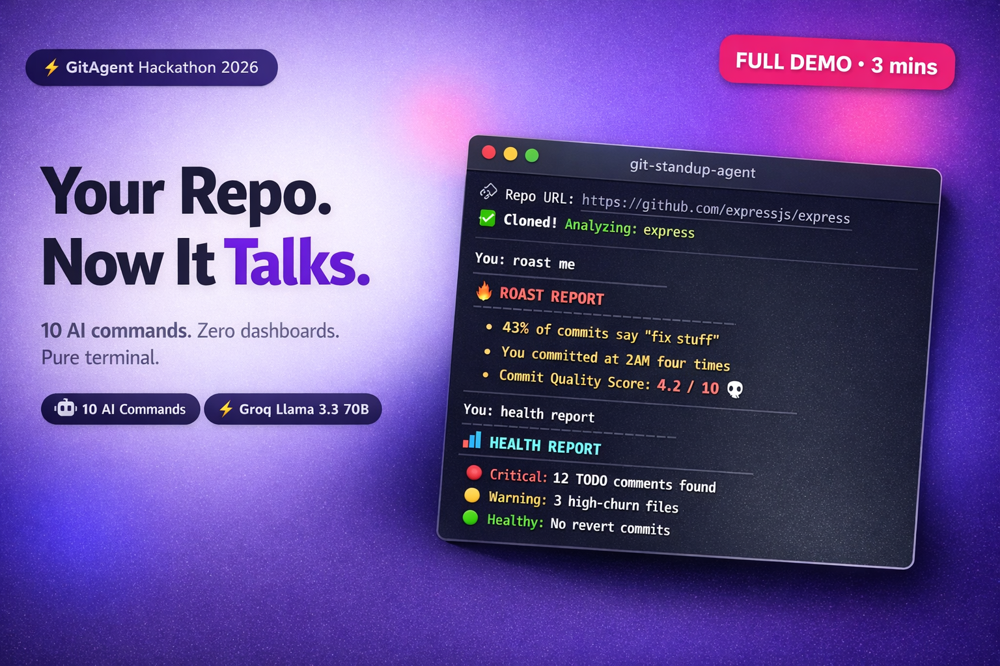
  </a>
</p>

---

## 📸 Screenshots

### 🔗 Repo Selection - Local or Any Public GitHub URL

At startup, the agent asks for a repo. Press Enter to use your local repo, or paste any public GitHub URL to analyze it instantly. The agent auto-clones it, reads the git history, and loads the command menu with live repo stats.

<p align="center">
  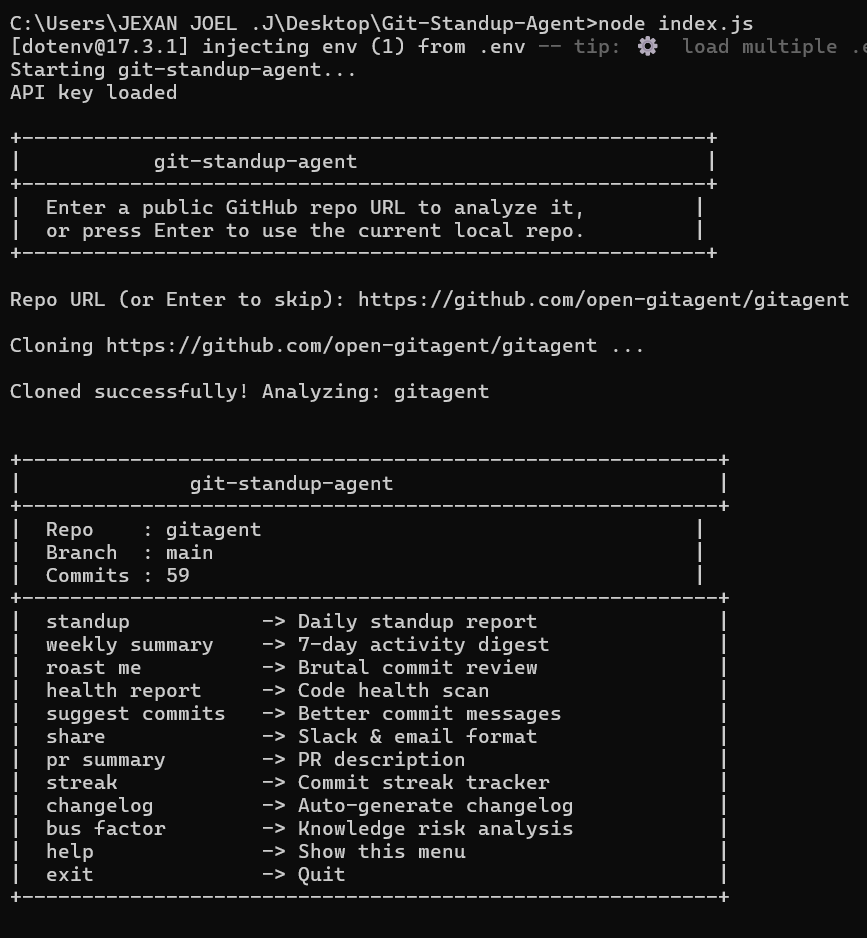
</p>

---

### 📋 Standup - Daily Progress Report

Turn your last 24 hours of commits into a clean daily standup, grouped by feature, fix, and chore. Perfect for sharing in team channels without manually digging through git history.

<p align="center">
  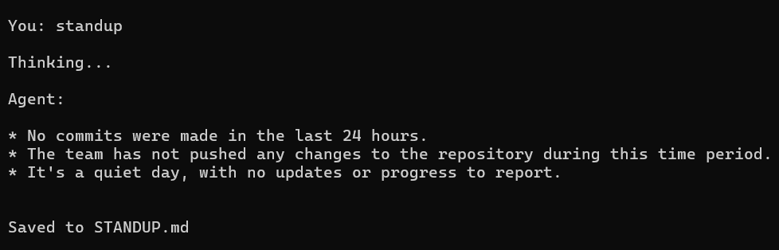
</p>

---

### 📅 Weekly Summary - 7-Day Digest

Get a full week of work summarized into a readable digest, grouped by type - features shipped, bugs fixed, and maintenance done. A simple way to review what actually got done.

<p align="center">
  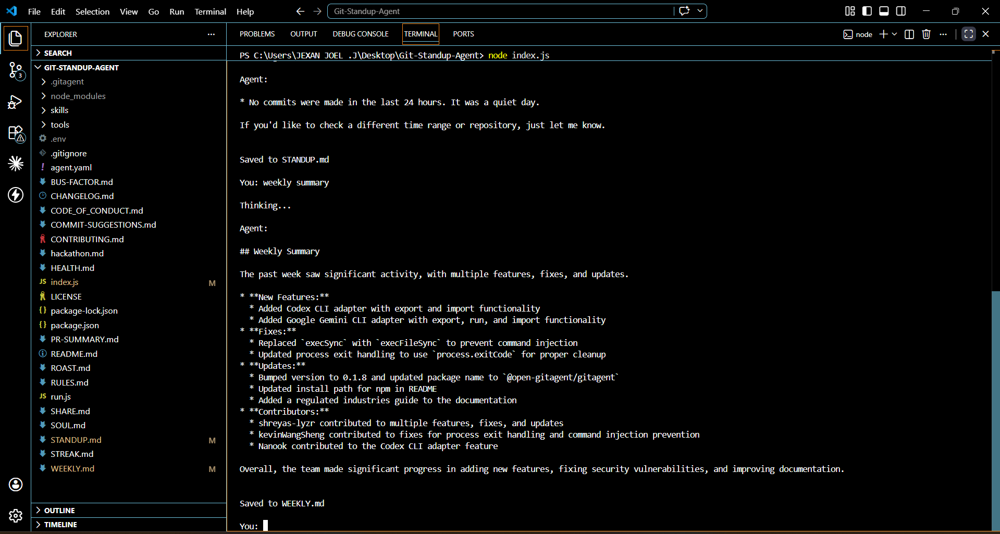
</p>

---

### 🔥 Roast Me - Brutal Commit Review

Get a brutally honest, funny AI review of your commit habits. Flags vague messages, lazy WIP commits, missing prefixes, and more - with a score out of 10 and one genuine compliment.

<p align="center">
  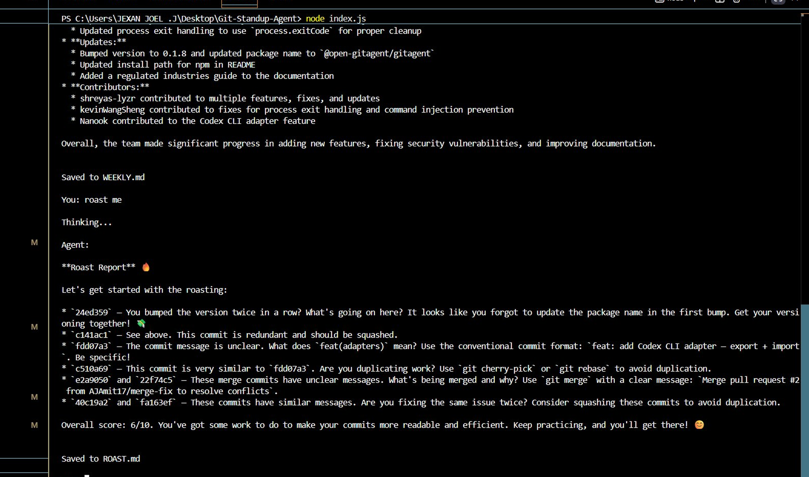
</p>

---

### 📊 Health Report - Code Health Scan

Scan your repository for TODOs, FIXMEs, high-churn files, revert commits, and tech debt signals. Get a structured report with 🔴 Critical, 🟡 Warning, and 🟢 Healthy sections - plus an overall health score.

<p align="center">
  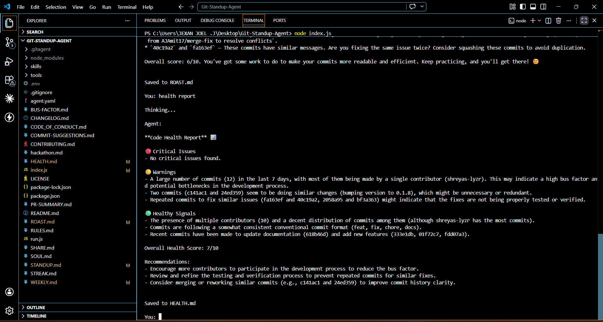
</p>

---

### 🎯 Suggest Commits - Better Commit Messages

Reviews your last 10 commit messages and rewrites any that are vague, lazy, or don't follow conventional commit format. Shows the original, the rewrite, and why it's better - with a Commit Quality Score.

<p align="center">
  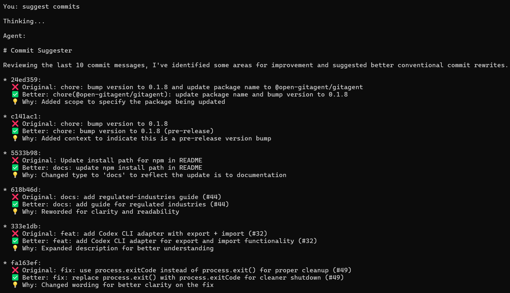
</p>

---

### 📧 Share - Slack & Email Ready

Takes your last standup and reformats it into two ready-to-paste formats - a Slack message with emoji and bold headers, and a professional email with subject line and sign-off.

<p align="center">
  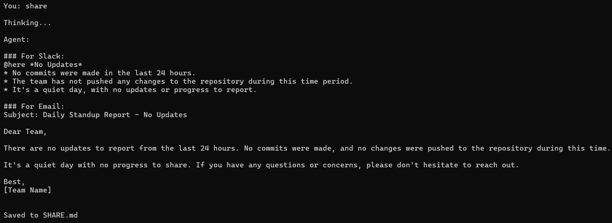
</p>

---

### 🔮 PR Summary - Auto PR Description

Analyzes your recent commits and changed files to generate a polished pull request description - what changed, why it changed, files affected, risks, and a suggested PR title.

<p align="center">
  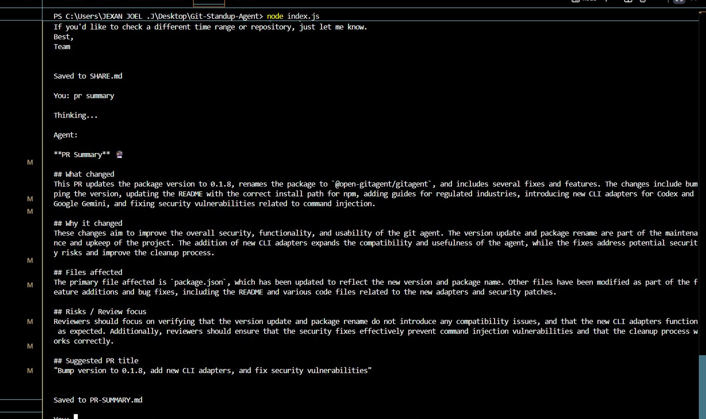
</p>

---

### ⏰ Streak Tracker - GitHub-Style Commit Streaks

Calculates your current commit streak, longest streak ever, most productive day of the week, most active time of day, and this week vs last week commit velocity. Ends with a motivational message.

<p align="center">
  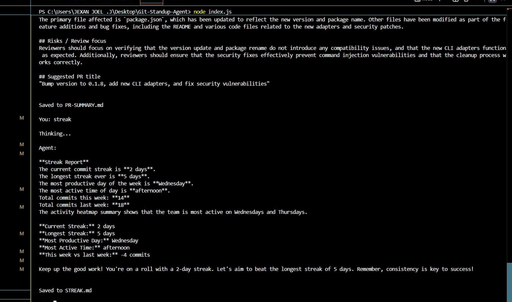
</p>

---

### 🧩 Auto Changelog - CHANGELOG.md Generator

Reads your entire commit history and generates a professional `CHANGELOG.md` following the [Keep a Changelog](https://keepachangelog.com) format - grouped by version or month, with Added, Changed, Fixed, and Removed sections.

<p align="center">
  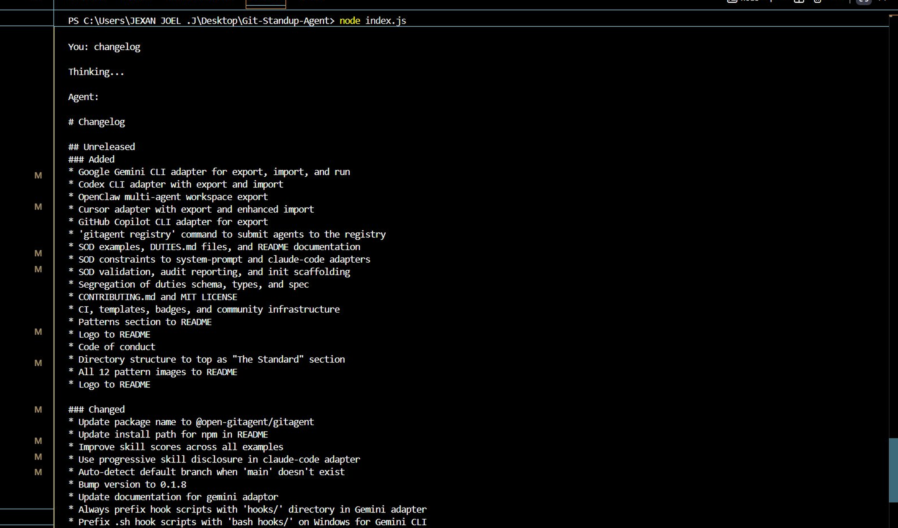
</p>

---

### 🚨 Bus Factor - Knowledge Risk Analysis

Identifies files that only one contributor has ever touched. Flags 🔴 high-risk files (single owner), 🟡 medium-risk (one person owns 80%+), and 🟢 healthy files - with an overall Bus Factor Score and recommendations.

<p align="center">
  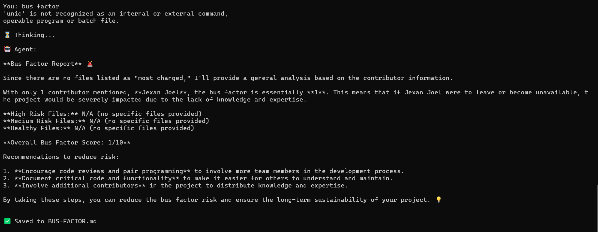
</p>

---

## 🚀 Quick Start

### Prerequisites
- Node.js 18+
- Git
- A free [Groq API key](https://console.groq.com) *(takes 2 minutes, no card needed)*

### Installation

```bash
# 1. Clone the agent
git clone https://github.com/JexanJoel/Git-Standup-Agent.git
cd Git-Standup-Agent

# 2. Install dependencies
npm install

# 3. Add your API key
echo "GROQ_API_KEY=your_key_here" > .env

# 4. Run
node index.js
```

At startup, you'll see:

```
┌─────────────────────────────────────────────────────────┐
│              git-standup-agent                          │
├─────────────────────────────────────────────────────────┤
│  Enter a public GitHub repo URL to analyze it,          │
│  or press Enter to use the current local repo.          │
└─────────────────────────────────────────────────────────┘

🔗 Repo URL (or Enter to skip): https://github.com/expressjs/express

⏳ Cloning...
✅ Cloned successfully! Analyzing: express
```

Then the full command menu loads with live repo stats and you're ready to go.

### Running via gitclaw SDK

```bash
# Install gitclaw
npm install -g gitclaw

# Run directly with a prompt
gitclaw --dir . --model groq:llama-3.3-70b-versatile "generate my standup for today"
gitclaw --dir . --model groq:llama-3.3-70b-versatile "roast my recent commits"
gitclaw --dir . --model groq:llama-3.3-70b-versatile "give me a health report"
```

### Validate the agent spec

```bash
# Install gitagent CLI
npm install -g @shreyaskapale/gitagent

# Validate
npx @shreyaskapale/gitagent validate
npx @shreyaskapale/gitagent info
npx @shreyaskapale/gitagent export --format system-prompt
```

Expected output:
```
✓ agent.yaml - valid
✓ SOUL.md - valid
✓ tools/git-log.yaml - valid
✓ skills/ - valid
✓ Validation passed (0 warnings)
```

---

## 🤖 Commands

<div align="center">
<table>
<tr>
<td align="center" width="33%"><a href="#-standup--daily-progress-report"></a><br/><sub>Daily standup from last 24hrs → <code>STANDUP.md</code></sub></td>
<td align="center" width="33%"><a href="#-weekly-summary--7-day-digest"></a><br/><sub>7-day digest grouped by type → <code>WEEKLY.md</code></sub></td>
<td align="center" width="33%"><a href="#-roast-me--brutal-commit-review"></a><br/><sub>Brutally honest commit review → <code>ROAST.md</code></sub></td>
</tr>
<tr>
<td align="center"><a href="#-health-report--code-health-scan"></a><br/><sub>TODOs, churn, tech debt → <code>HEALTH.md</code></sub></td>
<td align="center"><a href="#-suggest-commits--better-commit-messages"></a><br/><sub>Rewrites bad commit messages → <code>COMMIT-SUGGESTIONS.md</code></sub></td>
<td align="center"><a href="#-share--slack--email-ready"></a><br/><sub>Formats standup for Slack & email → <code>SHARE.md</code></sub></td>
</tr>
<tr>
<td align="center"><a href="#-pr-summary--auto-pr-description"></a><br/><sub>PR description from your changes → <code>PR-SUMMARY.md</code></sub></td>
<td align="center"><a href="#-streak-tracker--github-style-commit-streaks"></a><br/><sub>GitHub-style commit streak → <code>STREAK.md</code></sub></td>
<td align="center"><a href="#-auto-changelog--changelogmd-generator"></a><br/><sub>Auto-generate changelog → <code>CHANGELOG.md</code></sub></td>
</tr>
<tr>
<td align="center"><a href="#-bus-factor--knowledge-risk-analysis"></a><br/><sub>Single-owner file risk → <code>BUS-FACTOR.md</code></sub></td>
<td align="center"><br/><sub>Show command menu</sub></td>
<td align="center"><br/><sub>Quit the agent</sub></td>
</tr>
</table>
</div>

> ```
> You: standup
> ```

---

## 🏗️ How It Works

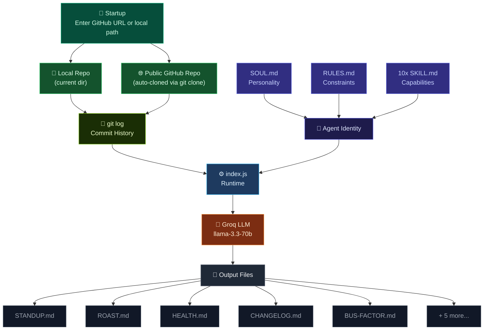

1. **At startup**, choose a local repo or paste any public GitHub URL - the agent auto-clones it
2. **Agent identity** is loaded from `SOUL.md`, `RULES.md`, and all 10 `SKILL.md` files
3. **Git context** is pulled live using `git log` for the relevant time range
4. **Groq LLM** processes the identity + context and generates the output
5. **Output** is printed to terminal and saved to a `.md` file automatically
6. **Temp clones** are automatically cleaned up on exit

---

## 🔧 Configuration

### Environment Variables

<div align="center">

| Variable | Required | Description |
|---|---|---|
| `GROQ_API_KEY` | ✅ Yes | Your Groq API key - [get one free](https://console.groq.com) |

</div>

### Model

The agent uses `llama-3.3-70b-versatile` via Groq by default. You can change the model in `agent.yaml`:

```yaml
model:
  preferred: "groq:llama-3.3-70b-versatile"
  fallback:
    - "anthropic:claude-sonnet-4-5-20250929"
    - "openai:gpt-4o"
```

---

## 🧩 Built With

<div align="center">

| Technology | Purpose |
|:---:|:---|
| [](https://github.com/open-gitagent/gitagent) | Git-native agent standard |
| [](https://groq.com) | LLM inference (free tier) |
| [](https://github.com/open-gitagent/gitclaw) | Agent runtime SDK |
| [](https://nodejs.org) | Runtime environment |

</div>

---

## 🤝 Contributing

Contributions, issues, and feature requests are welcome! See [CONTRIBUTING.md](CONTRIBUTING.md) to get started.

---

## 📄 License

<div align="center">

[](LICENSE)

</div>

---

<div align="center">

[](https://hackculture.in)

</div>