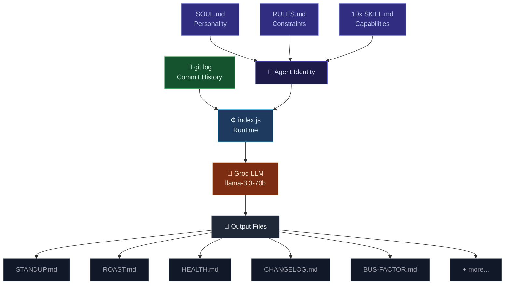

<div align="center">

<h1>🤖 Git-Standup-Agent</h1>

<p><strong>Your git repo has a memory. Now it can speak.</strong></p>

<br/>

<!-- BADGES -->
<div align="center">
<table>
  <tr>
    <td align="center"><a href="https://github.com/JexanJoel/Git-Standup-Agent"></a></td>
    <td align="center"><a href="LICENSE"></a></td>
    <td align="center"><a href="CONTRIBUTING.md"></a></td>
    <td align="center"><a href="https://hackculture.in"></a></td>
    <td align="center"><a href="https://github.com/sponsors/JexanJoel"></a></td>
  </tr>
</table>
</div>

<br/>

</div>

---

## 🧠 What is this?

`git-standup-agent` is an AI agent that **lives inside your git repository** - defined using the [gitagent open standard](https://github.com/open-gitagent/gitagent). It reads your commit history and turns raw git data into useful, human-readable intelligence.

No dashboards. No cloud sync. No third-party services. Just clone and run.

> *"Stop copying commit hashes into Slack. Let your repo speak for itself."*

---

## ✨ Features

<div align="center">

| Command | What it does | Output |
|---|---|---|
| `standup` | Daily standup from last 24hrs of commits | `STANDUP.md` |
| `weekly summary` | 7-day digest grouped by type | `WEEKLY.md` |
| `roast me` 🔥 | Brutally honest commit review | `ROAST.md` |
| `health report` 📊 | Code health scan - TODOs, churn, debt | `HEALTH.md` |
| `suggest commits` 🎯 | Rewrites bad commit messages | `COMMIT-SUGGESTIONS.md` |
| `share` 📧 | Formats standup for Slack & email | `SHARE.md` |
| `pr summary` 🔮 | Summarizes your changes as a PR description | `PR-SUMMARY.md` |
| `streak` ⏰ | Tracks your commit streak like GitHub | `STREAK.md` |
| `changelog` 🧩 | Auto-generates `CHANGELOG.md` from all commits | `CHANGELOG.md` |
| `bus factor` 🚨 | Identifies single-owner files - knowledge risk | `BUS-FACTOR.md` |

</div>

---

## 🚀 Quick Start

### Prerequisites
- Node.js 18+
- Git
- A free [Groq API key](https://console.groq.com) *(takes 2 minutes)*

### Installation

```bash
# 1. Clone the agent into your project
git clone https://github.com/JexanJoel/Git-Standup-Agent.git
cd Git-Standup-Agent

# 2. Install dependencies
npm install

# 3. Add your API key
echo "GROQ_API_KEY=your_key_here" > .env

# 4. Run
node index.js
```

## 🤖 Commands

<div align="center">
<table>
<tr>
<td align="center" width="33%"><a href="#"></a><br/><sub>Daily standup from last 24hrs → <code>STANDUP.md</code></sub></td>
<td align="center" width="33%"><a href="#"></a><br/><sub>7-day digest grouped by type → <code>WEEKLY.md</code></sub></td>
<td align="center" width="33%"><a href="#"></a><br/><sub>Brutally honest commit review → <code>ROAST.md</code></sub></td>
</tr>
<tr>
<td align="center"><a href="#"></a><br/><sub>TODOs, churn, tech debt → <code>HEALTH.md</code></sub></td>
<td align="center"><a href="#"></a><br/><sub>Rewrites bad commit messages → <code>COMMIT-SUGGESTIONS.md</code></sub></td>
<td align="center"><a href="#"></a><br/><sub>Formats standup for Slack & email → <code>SHARE.md</code></sub></td>
</tr>
<tr>
<td align="center"><a href="#"></a><br/><sub>PR description from your changes → <code>PR-SUMMARY.md</code></sub></td>
<td align="center"><a href="#"></a><br/><sub>GitHub-style commit streak → <code>STREAK.md</code></sub></td>
<td align="center"><a href="#"></a><br/><sub>Auto-generate changelog → <code>CHANGELOG.md</code></sub></td>
</tr>
<tr>
<td align="center"><a href="#"></a><br/><sub>Single-owner file risk → <code>BUS-FACTOR.md</code></sub></td>
<td align="center"><br/><sub>Show this menu</sub></td>
<td align="center"><br/><sub>Quit the agent</sub></td>
</tr>
</table>
</div>

> ```
> You: standup
> ```
---

## 🏗️ How It Works



1. **Agent identity** is loaded from `SOUL.md`, `RULES.md`, and all `SKILL.md` files
2. **Git context** is pulled live using `git log` for the relevant time range
3. **Groq LLM** processes the identity + context and generates the output
4. **Output** is printed to terminal and saved to a `.md` file automatically

---

## 🔧 Configuration

### Environment Variables

<div align="center">

| Variable | Required | Description |
|---|---|---|
| `GROQ_API_KEY` | ✅ Yes | Your Groq API key - [get one free](https://console.groq.com) |

</div>

### Model

The agent uses `llama-3.3-70b-versatile` via Groq by default. You can change the model in `agent.yaml`:

```yaml
model:
  preferred: "groq:llama-3.3-70b-versatile"
  fallback:
    - "anthropic:claude-sonnet-4-5-20250929"
    - "openai:gpt-4o"
```

---

## 🧩 Built With

<div align="center">

| Technology | Purpose |
|---|---|
| [gitagent](https://github.com/open-gitagent/gitagent) | Git-native agent standard |
| [Groq](https://groq.com) | LLM inference (free tier) |
| [llama-3.3-70b-versatile](https://groq.com/models) | The model powering the agent |
| [gitclaw](https://github.com/open-gitagent/gitclaw) | Agent runtime SDK |
| Node.js | Runtime environment |

</div>

---

## 🤝 Contributing

Contributions, issues, and feature requests are welcome! See [CONTRIBUTING.md](CONTRIBUTING.md) to get started.

---

## 📄 License

<div align="center">

[](LICENSE)

</div>

---

<div align="center">

Built for the **[GitAgent Hackathon 2026](https://hackculture.in)** 🏆

*Powered by the [gitagent open standard](https://github.com/open-gitagent/gitagent)*

</div>